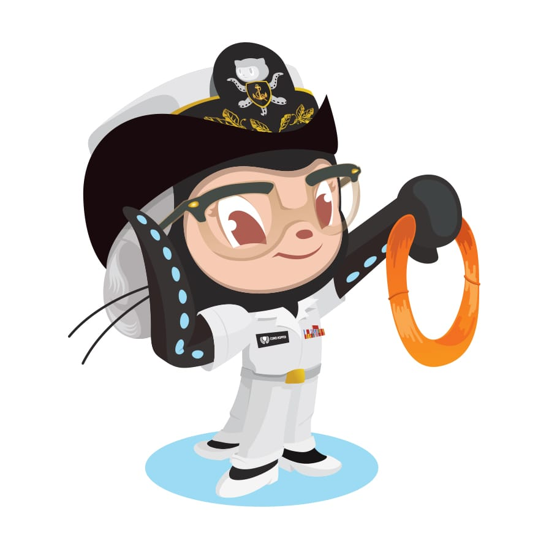

<p align="center">
  
  <br />
  <b>useKeepState</b>
  <p align="center">Similar to Vue keep-alive, But it is not a component.</p>
  <p align="center">
    <a href="https://github.com/mousejs/use-keep-state/stargazers"></a>
    
    
    <a href="https://hits.dwyl.com/mousejs/use-keep-state">
      
    </a>
  </p>
</p>


## Example

[codesandbox](https://codesandbox.io/s/mutable-breeze-fo8k7?file=/page-1.js)


## Install
```bash
npm i use-keep-state -S
```

## Example
No.1 Demo
```js
import React from 'react';
import useKeepState from 'use-keep-state';

// Must be unique
const namespace = 'App';

const initState = {
  number: 0
};

const App = () => {
  const [state, setState] = useKeepState(initState, namespace);

  const onClick = () => {
    setState({ number: state.number + 1 });
  };

  return (
    <div>
      <h1>{state.number}</h1>
      <button onClick={onClick}>Click</button>
    </div>
  )
}

export default App;
```

No.2 Demo
```js
import React from 'react';
import useKeepState from 'use-keep-state';

// Must be unique
const namespace = 'App';

const initState = {
  number: 0
};

const App = () => {
  const [state, setState, destroyState] = useKeepState(initState, namespace);

  const onClick = () => {
    setState({ number: state.number + 1 });
  };

  React.useEffect(() => {
    // Leave reset state
    return () => destroyState(namespace);
  }, []);

  return (
    <div>
      <h1>{state.number}</h1>
      <button onClick={onClick}>Click</button>
    </div>
  )
}

export default App;
```


## API
useKeepState(initState: object, [options]: object | string)

options
- namespace  // Unique name `String`
- keepAlive  // default `true`
- sessionStorage  // default `false`


## License
MIT
